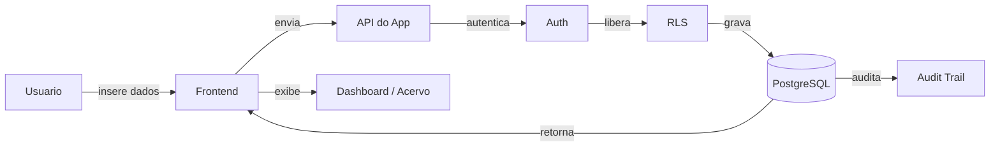
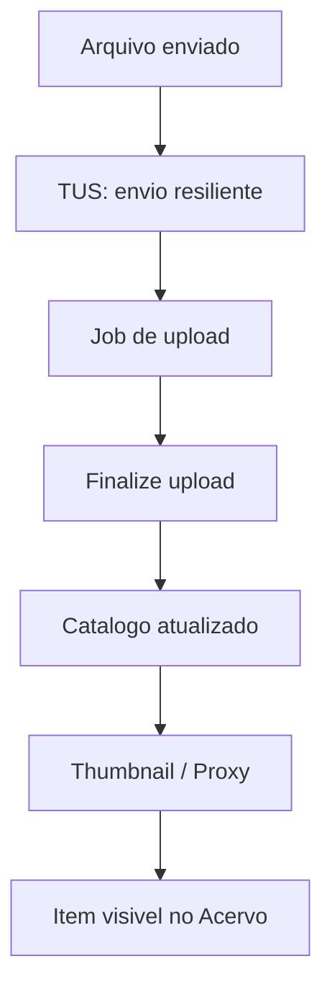

# Apresentacao do Aplicativo BibliotecaRC

> Documento de apresentacao executiva e tecnica, escrito para pessoas sem contexto previo. Explica o que o sistema faz, como funciona e por que e confiavel.

---

## 1) O que e a BibliotecaRC (Resumo Executivo)

A BibliotecaRC e um aplicativo web de catalogacao e gestao de midia (fotos e videos) da RC Agropecuaria. Ele organiza milhares de arquivos, garante que cada item tenha metadados consistentes, oferece busca rapida por localidade e tema, e controla quem pode ver ou editar dados. Tudo roda com seguranca e auditabilidade, permitindo rastrear cada mudanca feita no acervo.

---

## 2) Por que este sistema existe (Problema e Solucao)

**Problema:** Midias digitais crescem sem controle, viram pastas soltas, e fica dificil encontrar o que importa.

**Solucao:** A BibliotecaRC transforma arquivos em um acervo vivo:
- cada item recebe uma ficha tecnica;
- a busca encontra o item em segundos;
- o historico mostra quem alterou o que;
- o workflow garante ordem no processo.

---

## 3) Quem usa (Perfis)

- **Admin:** controla usuarios, regras e taxonomias.
- **Editor:** envia midias, cataloga e edita dados.
- **Viewer:** consulta e navega sem alterar conteudo.

---

## 4) Como o usuario enxerga o sistema (Paginas)

- **Dashboard:** painel de saude do acervo e alertas.
- **Acervo:** galeria geral com filtros por localidade e tema.
- **Localidade:** recorte por fazenda/area.
- **Upload:** envio de arquivos com catalogacao guiada.
- **Workflow:** kanban de status do material.
- **Item:** ficha tecnica completa.
- **Admin:** gestao de usuarios e configuracoes.

---

## 5) Fluxo do dado (explicado com setas)

---

## 6) Arquitetura tecnica (visao simples)

A BibliotecaRC e uma SPA (Single Page Application) em React, com dados no Supabase:

- **Frontend:** React + Vite + TypeScript + Tailwind.
- **Dados:** Supabase (PostgreSQL, Auth, Storage).
- **Processos:** Edge Functions para upload e automacoes.
- **Deploy:** Vercel.

---

## 7) Motor de dados (o tronco)

O coracao e o banco de dados, com tres pilares:

1) **RLS (Row Level Security):** define quem pode acessar o que.
2) **Foreign Keys:** impedem inconsistencias.
3) **Audit Trail:** registra todas as mudancas.

---

## 8) Pipeline de upload (do arquivo ao acervo)

- **TUS** garante envios grandes (ate 5GB) sem perder progresso.
- **Finalize** grava dados e confirma a integridade.
- **Process-outbox + CloudConvert** criam proxies e thumbnails quando necessario.

---

## 9) Taxonomia e workflow (organizar e controlar)

- **Taxonomia:** areas, pontos, temas e status padronizam a catalogacao.
- **Workflow:** cada item nasce em "Bruto" e passa por etapas ate "Publicado" ou "Arquivado".

Isso garante ordem, consistencia e rapidez na busca.

---

## 10) Seguranca e governanca

- **Autenticacao:** Supabase Auth.
- **Autorizacao:** perfis e RLS.
- **Auditoria:** toda alteracao fica registrada.
- **CORS e Webhooks:** controlados nas Edge Functions.

---

## 11) Integracoes externas

- **CloudConvert:** transcodifica videos para criar proxies.
- **Vercel:** publica a interface.

---

## 12) Resultado final (beneficios)

- Busca rapida e confiavel.
- Acervo organizado e escalavel.
- Controle de acesso por perfil.
- Historico de alteracoes completo.
- Processo de upload robusto.

---

## 13) Conclusao

A BibliotecaRC e um ecossistema completo de gestao de midia: organiza, protege, audita e entrega informacao com clareza. E uma base confiavel para o crescimento do acervo da RC Agropecuaria.

Contexto Carregado: Estou pronto para operar no BibliotecaRC.
