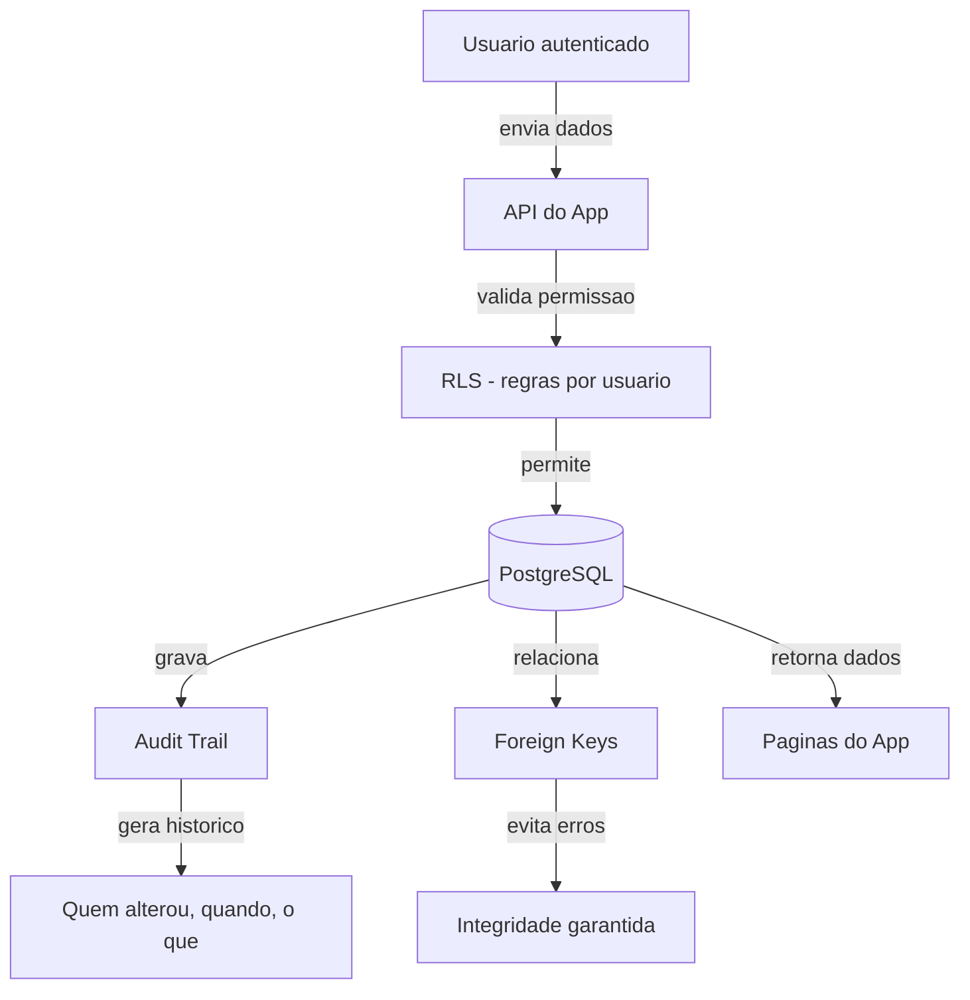
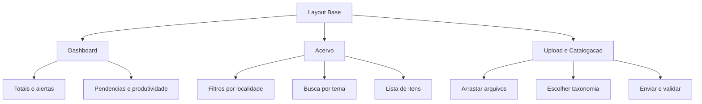
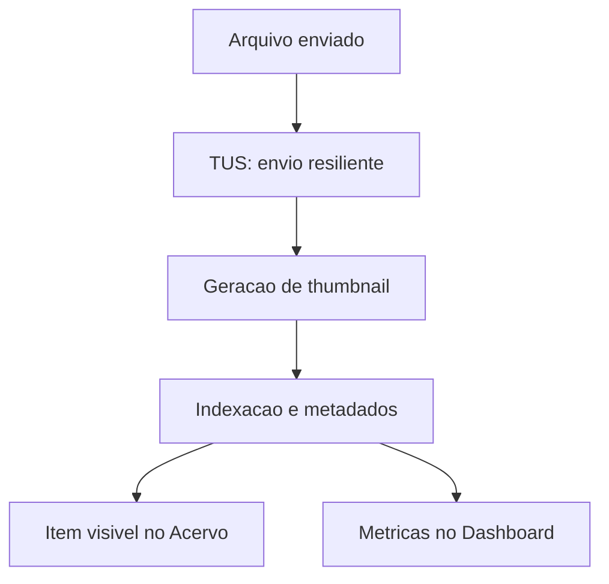
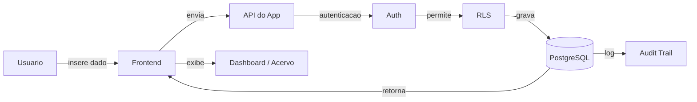
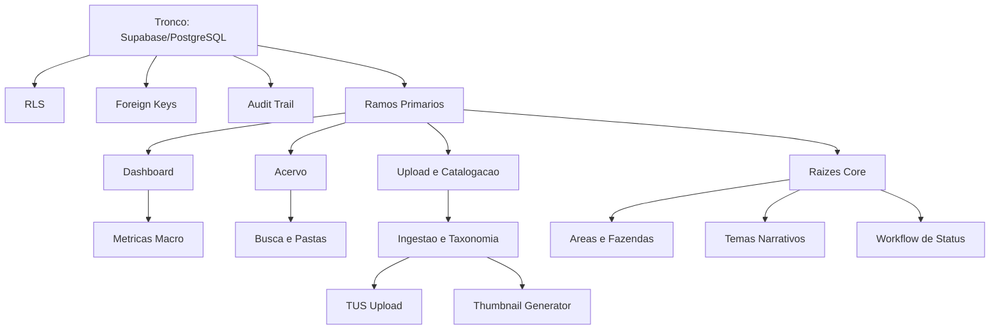

# Herodograma Sistemico da BibliotecaRC

> Documento de apresentacao estrategica do ecossistema BibliotecaRC, organizado como arvore genealogica funcional. Cada ramo descreve responsabilidades, acoes e consequencias tecnicas.

---

## Como ler este documento (para quem nao e tecnico)

Pense na BibliotecaRC como uma arvore:

- **Tronco** = a base que segura tudo: banco de dados e seguranca.
- **Ramos** = as paginas que as pessoas veem e usam.
- **Raizes** = processos invisiveis que mantem o sistema vivo.
- **Fluxo do dado** = o caminho que a informacao faz, do clique ate o resultado.

Se voce entender esses quatro pontos, voce entende o sistema inteiro.

---

## Visao Geral (Mapa da Arvore)

- **Tronco (Infraestrutura e Base de Dados)**: Supabase/PostgreSQL, RLS, FKs, Auditoria.
- **Ramos Primarios (Arquitetura de Paginas)**: Dashboard, Acervo, Upload/Catalogacao.
- **Raizes (Funcoes e Processos)**: Taxonomia, Workflow de Status, Pipeline de Midia.
- **Cenario da Pasta Mae**: Estrutura narrativa da raiz do repositorio.
- **Caminho do Dado**: Fluxo de validacao ponta a ponta.

---

## 1) O Tronco: Infraestrutura e Base de Dados (Hospedagem)

**Essencia:** O DNA do sistema vive no Supabase, apoiado pelo PostgreSQL.

### 1.1 Hospedagem da Base (Supabase/PostgreSQL)
- **Natureza:** Banco relacional, consistente e auditavel.
- **Consequencia:** Confiabilidade nos registros e historico consultavel.

### 1.2 Validacao de Dados (Hereditariedade de Seguranca)
- **RLS (Row Level Security):** Somente usuarios autorizados acessam linhas permitidas.
- **Foreign Keys:** Garantem integridade entre itens, fazendas e relacionamentos.
- **Audit Trail:** Toda mudanca gera log (quem, quando, o que mudou).

**Resultado:** Dados validos, rastreaveis e com governanca.

---

### Infograma do Tronco (Infraestrutura)



---

## 2) Ramos Primarios: Arquitetura de Paginas e Navegacao

Cada pagina herda o Layout Base e a estetica cinematografica de luxo.

### A) Dashboard (O Centro de Comando)
- **Funcao:** Visao macro da saude do acervo e produtividade.
- **Subfuncoes:** Totais, pendencias, aprovados, publicados.
- **Acoes/Consequencias:** Identificacao de gargalos e acionamento de manutencao.

### B) Acervo (A Galeria Imersiva)
- **Funcao:** Exploracao por localidade e tema.
- **Subfuncoes:** Filtros dinamicos, busca textual, navegacao por pastas.
- **Acoes/Consequencias:** Selecionar item abre ficha tecnica detalhada.

### C) Upload e Catalogacao (O Processo de Ingestao)
- **Funcao:** Entrada de novos materiais.
- **Subfuncoes:** Drag-and-drop, taxonomia, metadados.
- **Acoes/Consequencias:** Upload completo dispara processamento e indexacao.

---

### Infograma dos Ramos Primarios (o que cada pagina faz)



---

## 3) As Raizes: Funcoes, Subfuncoes e Funcionalidades

### 3.1 Sistema de Acervo (Core)
- **Areas e Fazendas:** Catalogacao por localidades.
- **Temas Narrativos:** Classificacao ampla para busca semantica.
- **Workflow de Status:** Bruto → Triagem → Catalogado → Aprovado → Publicado/Arquivado.

### 3.2 Pipeline de Midia (Processamento)
- **TUS (Upload Resumable):** Suporte a arquivos grandes, tolerante a falhas.
- **Gerador de Thumbnails:** Cria capas automaticamente para videos.

---

### Infograma das Raizes (processos invisiveis)



---

## 4) Cenario da "Pasta Mae" (Organizacao de Diretorios)

Estrutura narrativa para apresentacao e manutencao clara:

```
/ (Pasta Mae)
├─ src/        # O Sangue: React vivo (components, pages, hooks)
├─ supabase/   # A Mente: migrations e functions
├─ docs/       # A Memoria: planos, relatorios, design, runbooks
├─ public/     # Os Sentidos: fontes, icones, logos
```

---

## 5) Narrativa de Validacao: O Caminho do Dado

1. **Entrada:** Usuario interage no frontend.
2. **Verificacao:** Auth + RLS validam permissao.
3. **Registro:** Postgres grava com integridade.
4. **Auditoria:** Log automatico de alteracao.
5. **Exposicao:** Reflete em Dashboard e Acervo.

---

### Fluxo detalhado do dado (com setas)



---

## 6) Grafico de Heranca (Visao de Apresentacao)



---

## 7) Glossario simples (traducoes rapidas)

- **Supabase/PostgreSQL:** Onde os dados ficam armazenados.
- **RLS:** Regra que decide quem pode ver o que.
- **Foreign Keys:** Travas para evitar cadastro incoerente.
- **Audit Trail:** Diario automatico de alteracoes.
- **Taxonomia:** Lista organizada de categorias e temas.
- **Indexacao:** Organizar dados para busca rapida.

---

## 8) Conclusao

A BibliotecaRC se organiza como um organismo com heranca tecnica clara: dados seguros no tronco, paginas como ramos de operacao, e funcoes essenciais enraizadas no processamento e na taxonomia. Essa estrutura torna a apresentacao simples, a manutencao previsivel e a evolucao segura.

---

# ATIVIDADE: Ingestao e Analise Profunda de Base de Codigo (Full Context)

**CONTEXTO:**
Eu estou fornecendo um arquivo ZIP ("pasta base") que contem todo o codigo-fonte, documentacao e ativos do meu aplicativo.

**SUA PERSONA:**
Voce e um Arquiteto de Solucoes de Elite e Engenheiro de Software Principal. Sua capacidade de analise e meticulosa, tecnica e orientada a sistemas. Voce nao deixa passar detalhes de implementacao, dependencias ou regras de negocio.

**SEU OBJETIVO:**
Realizar uma autopsia completa e nao destrutiva do arquivo fornecido para "carregar" todo o contexto do projeto na sua memoria de curto prazo. Voce deve entender este aplicativo melhor do que o desenvolvedor original.

**INSTRUCOES DE EXECUCAO (Passo a Passo):**

1.  **DESCOMPACTACAO E INDEXACAO:**
  * Liste internamente a estrutura de diretorios.
  * Identifique a stack tecnologica (Linguagens, Frameworks, Bibliotecas, Banco de Dados).

2.  **ANALISE ESTRUTURAL (Macro):**
  * Analise como os arquivos se relacionam. Quem chama quem? Onde esta a entrada (entry point)?
  * Mapeie a arquitetura (MVC, Microservicos, Monolito Modular, etc.).

3.  **ANALISE DE FUNCIONALIDADE (Micro):**
  * Leia a documentacao disponivel para entender o "Dever Ser".
  * Cruze a documentacao com o codigo real para entender o "E".
  * Identifique as principais entidades de dados e regras de negocio.

4.  **ANALISE DE COMUNICACAO:**
  * Mapeie como os dados fluem (Frontend -> Backend -> Banco).
  * Identifique integracoes externas (APIs, Webhooks).

**SAIDA ESPERADA (OUTPUT):**

Nao me de sugestoes de codigo agora. Eu preciso que voce me prove que entendeu o sistema. Responda APENAS com o seguinte relatorio estruturado:

1.  **Resumo Executivo:** O que e este aplicativo em 1 paragrafo?
2.  **Tech Stack Detectada:** Lista das tecnologias principais.
3.  **Mapa de Arquitetura:** Uma explicacao concisa de como o sistema e organizado.
4.  **Funcionalidades Criticas:** Liste as 5 principais funcionalidades que voce identificou no codigo.
5.  **Pontos de Atencao:** Alguma area do codigo parece complexa, obscura ou critica? (Ex: autenticacao, processamento de pagamentos).

**CONFIRMACAO FINAL:**
Termine sua resposta com a frase: "Contexto Carregado: Estou pronto para operar no [Nome do App/Sistema]."
